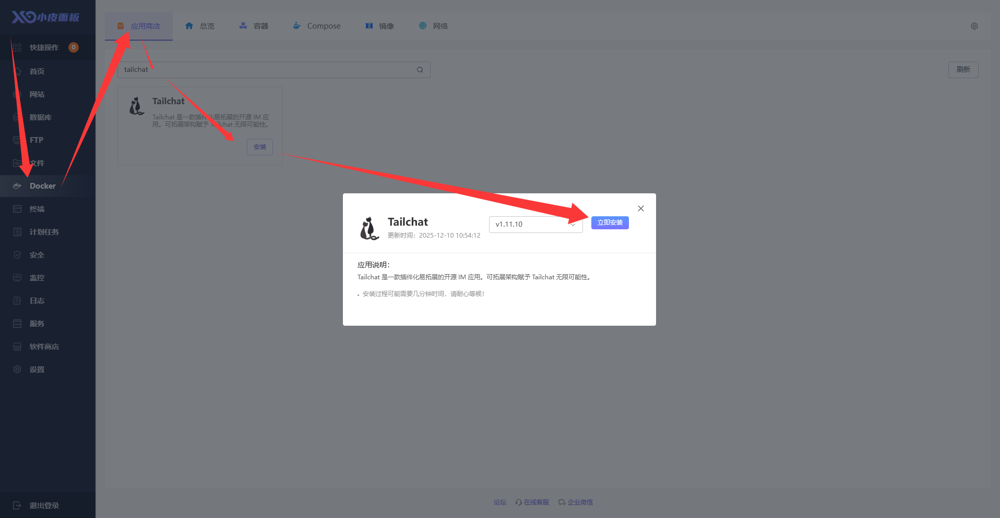
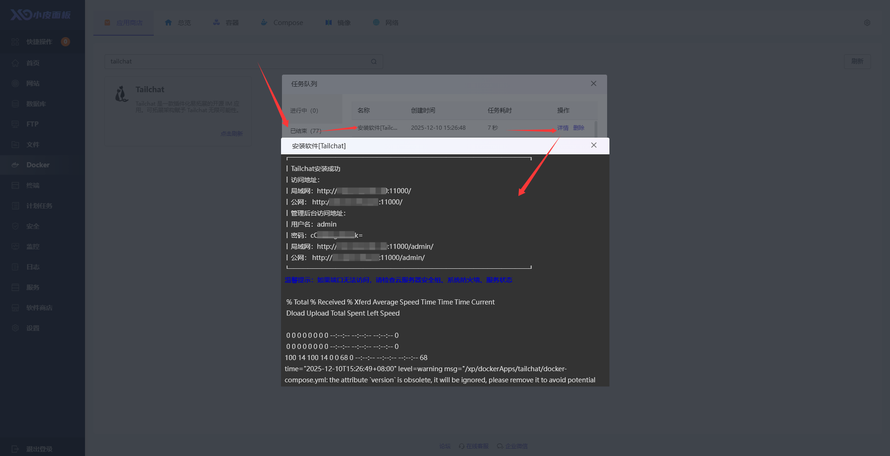
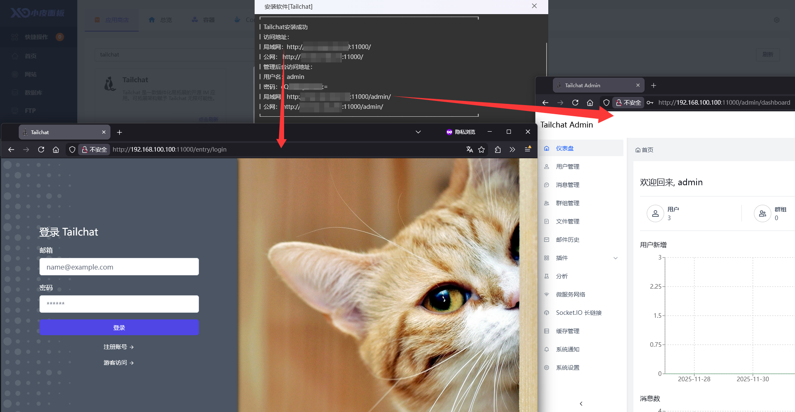

:::info
Tailchat 已上架小皮面板的Docker应用商店，您可以在应用商店中一键安装Tailchat

小皮面板，好用安全稳定的服务器面板: [https://www.xp.cn](https://www.xp.cn)
:::

## 安装小皮面板

如果您已经有小皮面板服务器，直接登录小皮面板，跳过本节内容即可。

[点击此处](https://doc.xp.cn/linux)可以跳转到小皮面板使用文档，查看如何安装、使用小皮面板

## 在Docker应用商店安装

登录到小皮面板，在侧边栏点击 `Docker` 菜单，然后在应用商店中搜索 Tailchat，点击`安装` > `立即安装`按钮

等待安装结束后，可以查看安装信息（安装等待时间主要取决于服务器网络）

在浏览器根据输出信息在浏览器中访问即可

